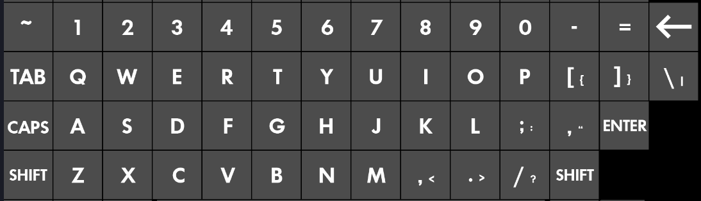

# Keyboard Kingdom

[Play the Game](https://exevirus.github.io/Keyboard-Kingdom)

```
Build your kingdom,
Defend your kingdom,
Be patient with your kingdom,
Grab a friend for your kingdom,
Do a dance to the rhythm of your kingdom, 
Evolve your kingdom,
Take to the heavens above your kingdom, 
Transcend your kingdom.
```

Or in Haiku form:

```
     Create your great kingdom.
   Defend, cherish, this kingdom.
      Transcend the kingdom.
```

# Rough Idea

The input device of the game is the entire keyboard.

More specifically, none of the function keys, and none of the bottom row of keys. So, roughly 12x4 rows, plus the extra 5 in the top right corner (looking at you `return, +, ], \, and backspace`), and numpad island.

For example, excluding numpad island:


Enemies will come from the right, down the four lanes of keys.

You start by placing your kingdom on the left half, and can initially, only
click that keyboard key of the kingdom, and any other empty key.
When you click an empty key, a smite from the heavens lands on that key, this ability does have a short cooldown...

To grow your kingdom, you will hold down your kingdom key. Build with spacebar when you have enough [resource_name], and don't let your kingdom fall. Enemies will gradually get stronger. There are difficulty levels.

Each building is unique, die when an enemy touches them (both explode), and must be rebuilt before forward progress can be made. Some buildings are resource generating, others have unique abilities, and others are plain defensive buildings. 

There may be different civilizations, with different tech trees, so you have full defensive - bad econ, great econ - bad defensive, etc. Not every building will be used by every tech tree (except the default tech tree)

#### Note: 

Keyboards do have a physical limit of the number of simultaneous keys they can respond to at once, and each keyboard is different - even in single player you might benefit from multiple keyboards, also keep in mind optimal placement so you don't fry your fingers... you have been warned.

# Backend Design

Tech trees will simply be a text list, everything will be json...

I'll build it in html5 + canvas element. keyboard-js for input, LOTS of timer code, gif2sprite sheet will be used heavily, etc. 

Only needs like 10 different kinds of enemies or something, most of the variety will come from the buildings and their input styles - even though they are single-key...

# Technical Design:

Four base classes: Game, InputManager, Tile, and Enemy.

### Game

Stores the game configuration and setup (difficulty, keyboard, etc.), will track resources and timers and other core game functionality like next building to build, current build-list-order, etc.

### KingdomManager

Handles the callbacks to the tiles as keyboard keys are pressed.

### Tile

Stores and displays and interacts: Stores the keybind letter text, stores the building it contains (for callback functionality), tracks health, if relevant, provides a collision box for the arcade physics to handle for us

### Enemy

Meant to be overriden with textures, sounds, etc.

The default walks left, and has a callback when it collides with any tile, (tile handles 'damage')


# Blog

### Day 1 (0.25 hours)

Created this readme and repository.

### Day 2 (0.25 hours)

Turns out Github (GH) is great for hosting your plain html sites - ideal for hosting my game right here from the repository. I went ahead and made index.html, which is alway what is loaded by the website by default. I may have to write the entire game in that single file, just so load times don't suffer for all of you. Assets would still be loaded separately, but at least I could make the game there. Went ahead and put the worlds smallest snake implementation there, it's literally 384 bytes, dang. So now the game is hosted [here](https://exevirus.github.io/Keyboard-Kingdom)

### Day 3 & 4: (0.1 hours)

Yeah nothing - did have an idea inspired by Paul - One of the game modes will randomize the placement of the keys on the keyboard layout :)

### Day 5: (0.5 hours)

Well, I'm not quite sold on it yet, but it looks like I'll be using [phaser 3](https://phaser.io/phaser3) as my framework. I worry it will be too wordy or API heavy, but I think I see my path pretty straightforward - pretty much everything becomes a callback in this design or uses delta-time and I just hope the framerate stays at 60 FPS.

I figure it won't be too rediculous considering that my game loop is "detect keys", move up to 100 things left, do collision detections, handle callbacks, done. 

So I guess my next step is get hello world made: background image + keyboard image for layout (It'll probably just be static and 16:9 scale in a 1280x720 screen) + Kingdom image for the left four keys + detection of keydown events across the 53 total keys in the first go of this. The first four keys will result in a number go up, and the other keys will merely create an animatied explosion when pressed. No enemies yet. 

### Days 6-10: (0.25 hours)

Not much, mostly just made the thing fit to screen and use 1080p by default for internal resolution, Learned a bit about Webfont loading and got that working so I can use Google fonts, which is nice.

### Day 11: (1.0 hours)

Alrighty, my first real work day! Got a "Menu scene" with "ENTER" keyboard input, that loads the "Main" game scene, and that main scene can take data from the start() command from the menu scene. Figured out centering text and how to split everything up into separate js files because it's hard to keep everything separated otherwise. Will see how hard sharing data is...

Also considered fullscreen, but then the escape key won't be available for pause, just gotta think that idea through...

### Day 18: (0.75 hours)

So I learned that everything must be done in a dynamic texture, which is a render target. 

Each key will, at creation, create its dynamic texture, and when something is built on it, that building texture will be used in the re-render of that key. The key then stores what building (string) it's keydown points to. On press, that keydown is called. "" empty string is a valid building (laser) Each building will have a callback for collision, and a callback for keypress. 

Kingdom manager will contain these callbacks and buildings, as well as any tracker variables and timers required by the game mechanics.
Note on design: should figure out a way to have all buildings defined, but have multiple instances of the same building (for separating cooldowns, when applicable, alternatively I could also just pass the key associated with that building callback, so we have more information.)

Work completed: 
- figured out the dynamic texture stuff
- figured out how to load an image with text on it and position things with sprites

Next Steps:
- Next is click() and keydown callbacks for these keys and encapsulation of the key into its own class
- Then kingdom manager on-press callbacks created for some buildings, for now focusing on "", "kingdom_1 -> kingdom_4"

### Day 21: (1.5 hours)

Progress was getting slowed down in the absolute mess that is commonJS and ECMA and loading modules and whatnot. It's terible. 

So I gave up on going it "simple" and broke down and got a copy of a template from the phaser folks using webpack. webpack is a super-bundler that is handy when it works, and painful because it has like 10,000 dependencies.... Anyways, I'm using `bun` instead of `node.js`, the install and stability is fricken amazing comparitively, I love it. 

So to build and test this now:

1. Install bun, which is always a single command line in some terminal
2. nav to this repo / clone this repo
3. bun install
4. bun run dev
5. Edit and make changes and things auto-reload pretty fast.

### Day 22: (1 hours)

Sigh, this is taking too much time, but main menu is about done, Just have to get some remaining keys working. Turns out that phaser 3 doesn't define nearly all the keys at all. minus, equals, caps_lock, etc. They're all just wrong haha. I plan to make a custom handler using keyboard.js to help get the keycodes for what I want. 

Either way, main menu now has a keyboard color selector just like I wanted!

### Day 24 - part 1: (1.5 hours)

Got the keyboard keys all working using keyboardjs! Also got some bugs from switching scenes all worked out. Got the keyboard positioned for playing now, probably won't move it for the rest of the game dev haha. Next step is to get some building textures, and create the building management system. Then on to enemies and we'll be close to finished.

### Day 24 - part 2: (0.5 hours)

Added a cool hip logo, also changed the main screen to be semi-centered


